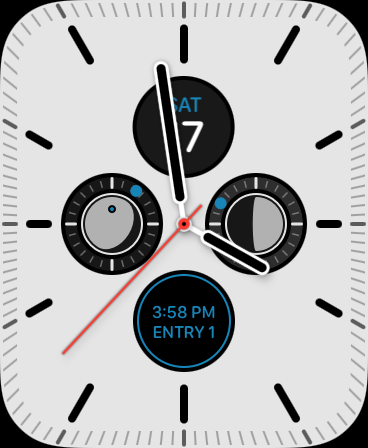

# ItsComplicated

Complications in watchOS are complicated. The process is opaque with little feedback to let you know what's happening. Debugging a refresh problem can literally take hours.

If you've ever wondered why your complications aren't updating, this project should help you get to the bottom of things by making the updates more visible and something that you can track over a long period of time (without a debugger connected). I wrote this code as a testbed for complications that show the position of the Sun and Moon (shown in the left and right positions in the screenshot below). Celestial bodies move rather quickly and I wanted the complications to update frequently.

The approach is simple: the complication displays the time it was created for and its position in the timeline. If you see "12:00 PM, ENTRY 3" you know that it's the third entry in the timeline and has data that's current at noon. When "CURRENT" is displayed, the complication has just been generated. "TEMPLATE" is displayed when the complication is previewed in the complication picker.

<figure>
	
	<figcaption>The complication showing the first timeline entry for 3:58 PM</figcaption>
</figure>

When the complications are refreshed, this sample code distributes the timeline entries over several spans of time. The first 10 entries are a minute apart, the next 20 are at 5 minute intervals, followed by 40 at 15 minute intervals, and finally 30 at a 1 hour interval. This gives you 100 timeline entries that will provide information for about a day and a half. This complication refresh is scheduled as a background task that repeats every hour.

This covers a worst-case scenario: you're likely to see the complication display a time that's never more than 5 minutes from the current time.

The sample also shows how you can support multiple complications in a single watchOS app. The first complication has a ring around the data, the second one does not. Note that only the Graphic Circular complication is supported, but it should be clear how and where to introduce support for other complication styles.

This project was created using the standard watchOS standalone template in Xcode 12. The classes and comments from Apple are left in place. My comments are preceded with "NOTE:". Also note that debugLog() is used to show when complications are refreshed. My code changes are in the following files:

* `ComplicationRefresh.swift` - `ExtensionDelegate` and `ComplicationController` extensions used to schedule and generate complication timeline entries.
* `ComplicationRendering.swift` - A `ComplicationController` extension to draw the complication's information.
* `WatchSizing.swift` - A `WKInterfaceDevice` extension that helps you size a template image based on the complication family and watch case size.

Enjoy!

